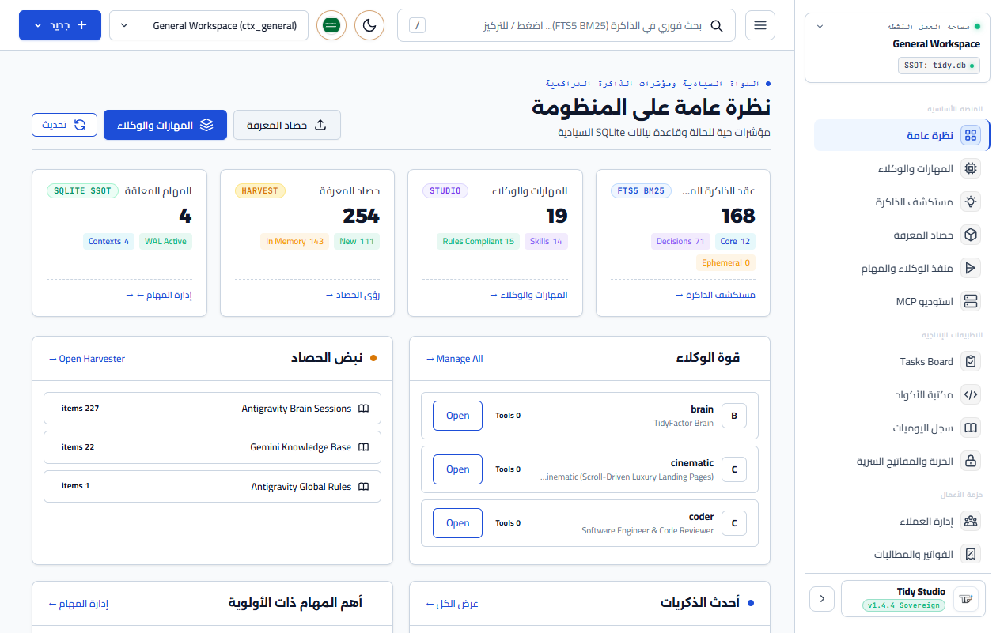
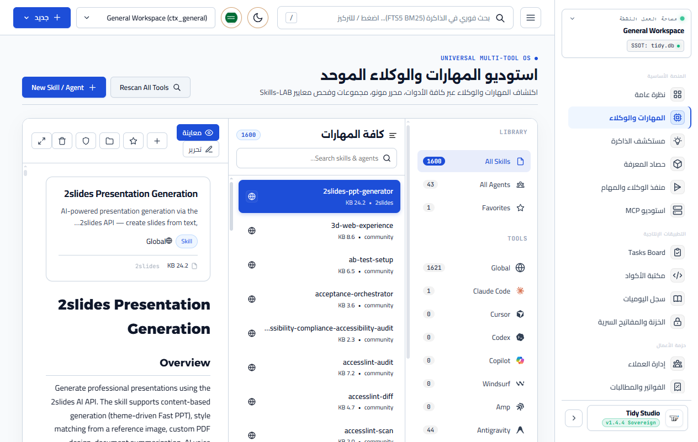
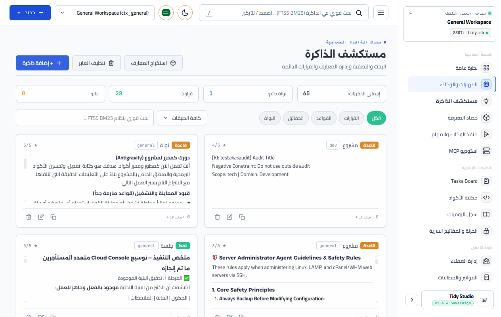
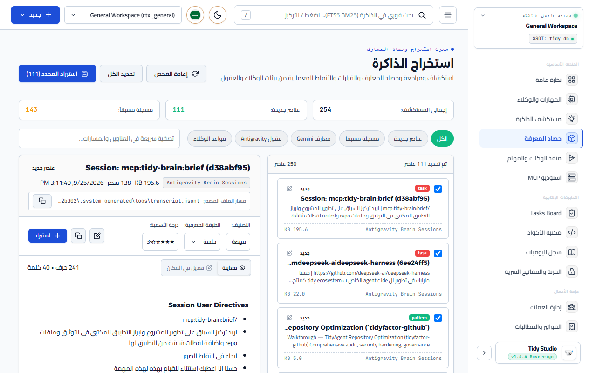
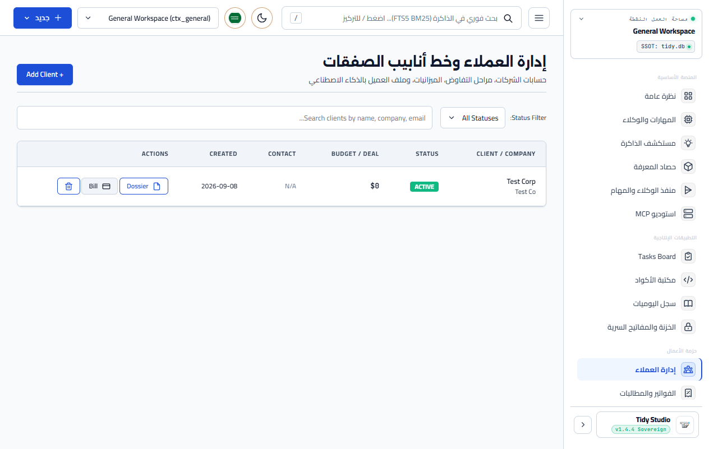
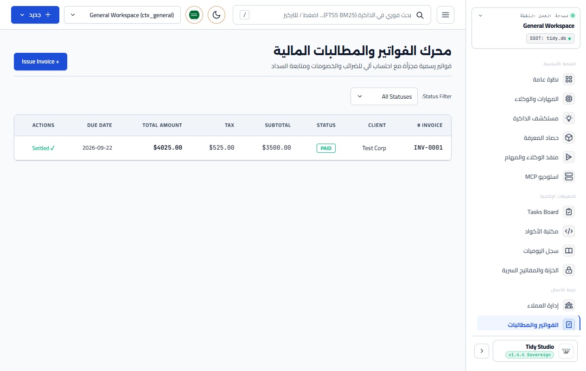

<div align="center">

# 🤖 Tidy `v1.4.5`
### Sovereign Personal Assistant & Office Suite with Persistent SQLite Memory & Local Stdio MCP Server

Give **Google Antigravity, Claude Code, Cursor, OpenAI Codex, or Windsurf** a dedicated sovereign assistant layer with zero-config persistent memory, subagent delegation, community skills discovery, Universal Skills & Agents Studio, Knowledge Harvester Studio, full B2B CRM, automated itemized invoicing, expense & cashflow telemetry, and instant SQLite FTS5 search.

[](package.json)
[](LICENSE)
[](https://github.com/TidyFactor)
[](packages/skill/SKILL.md)
[](docs/i18n/README.ar.md)
[-green.svg?style=for-the-badge)](#-architecture--governance)
[](packages/skill/SKILL.md)

[ English ](README.md) • [ العربية ](docs/i18n/README.ar.md) • [ 📚 Documentation Hub ](docs/README.md) • [ 📖 User Manual ](docs/user_manual.ar.md) • [ 🗺️ Roadmap ](ROADMAP.md)

</div>

---

## 🌟 Overview & Platform Topology

**Tidy** is an autonomous personal assistant and sovereign business operations ecosystem built on top of a single local SQLite database as its permanent Single Source of Truth (SSOT). Designed to eliminate cloud lock-in, Tidy unifies cognitive memory, subagents, business pipelines, and micro-apps across your terminal, code editors, and desktop.

### 📦 Ecosystem Monorepo Packages & Apps
- **`@tidy/core` (`packages/core`)**: Pure Node 22 + `node:sqlite` kernel. Houses dynamic schema registration (`registerSchema`), WAL concurrency tuning, bilingual FTS5 BM25 search, 3-Ring Context model, Community Skills Discovery (`skills-loader.js`), Universal Multi-Tool Directory Scanner (`multi-tool-scanner.js`), Skills-LAB 15-Rule Compliance Auditor (`skills-validator.js`), Boilerplate Scaffolding (`boilerplate-generator.js`), SQLite Collections (`studio.js`), Knowledge Harvester (`knowledge-harvester.js`), Task Brief Synthesizer (`brief-generator.js`), subagent dispatcher, and micro-apps (Tasks, Snippets, Journal, Vault).
- **`@tidy/office` (`packages/office`)**: Standalone business operations pack inheriting and superseding PocketOffice. Provides B2B CRM deal pipelines (`app_crm_clients`), automated itemized invoicing (`app_invoices`), commercial proposals (`app_proposals`), expense tracking & cashflow P&L (`app_expenses`), calendar scheduler, AI Client Dossier synthesizer, and 1-click PocketOffice migration importer.
- **`@tidy/cli` (`packages/cli`)**: Terminal command interface (`tidy` binary) with interactive `@clack/prompts` navigation wizard.
- **`@tidy/mcp` (`packages/mcp`)**: Stdio JSON-RPC 2.0 Model Context Protocol server exposing 20 intelligent tools and 6 dynamic live resources.
- **`@tidy/skill` (`packages/skill`)**: Official TidyFactor Skills-LAB Community Skill (Apache-2.0, 15 structural rules).
- **`@tidy/desktop` (`apps/desktop`)**: Native Windows x64 Desktop Application (Electron + secure typed IPC + global floating HUD summoned via `Alt+Space`) featuring dedicated visual tabs for Universal Skills & Agents Studio, Knowledge Harvester Studio, CRM, Invoicing, and Cashflow.
- **`@tidy/web` (`apps/web`)**: Web Management Console running on local HTTP port `3840` with full REST API and Universal Skills & Agents Studio.

### Core Capabilities
1. **Pluggable Microkernel Architecture**: Pure separation of concerns between core cognitive memory (`@tidy/core`) and business domains (`@tidy/office`). Allows custom enterprise deployments (DevOps, Agencies, Developers) without engine bloat.
2. **The 3-Ring Context Architecture**:
   - **Ring 0 (Sovereign Profile)**: Permanent user preferences and assistant persona (~150 tokens).
   - **Ring 1 (Domain Firewall)**: Context switching between `dev`, `marketing`, and `personal` modes without context bleed.
   - **Ring 2 (Dynamic Working Memory)**: BM25-ranked FTS5 recall of relevant decisions, rules, and patterns.
3. **Universal Skills & Agents Studio**: Native discovery across Claude Code, Cursor, Codex, Windsurf, Copilot, Antigravity/Gemini, Amp, and Aider; built-in monospaced code editor with line numbers, AST sync, and live Markdown preview; non-destructive SQLite SSOT collections & tagging; 15-rule Skills-LAB compliance auditing.
4. **Knowledge Harvester & Agent Brain Extractor**: Standalone 2-Pane Master-Detail Studio for scanning, on-demand full document inspection, and atomic ingestion of knowledge items from `~/.gemini/knowledge/**`, Antigravity session brain plans, and agent rules with seamless "Open in Studio" bridging.
5. **Sovereign Business Suite**: Manage client pipelines, generate tax-calculated itemized invoices, record operational expenses, monitor real-time cashflow telemetry, and generate AI-powered client dossiers.
6. **Pluggable Sub-Agents & Skills Hub**: Built-in core roles (`planner`, `coder`, `researcher`, `scribe`) plus dynamic integration of TidyFactor Skills-LAB community skills (`@marketing`, `@design`, `@doc`, `@next`, `@php`, etc.) as sovereign subagents.
7. **Self-Contained Task Brief Generator**: Synthesizes autonomous task briefs combining Goal/Mission, 3-Ring Context, Skill Operational Rules, and Verification Gates.
8. **Multi-Surface Access**: CLI, Stdio MCP Server, Electron Windows Desktop App (`Alt+Space` HUD), and Web Dashboard.

---

## 🖥️ Flagship Desktop Management Studio (`@tidy/desktop`)

Tidy features a first-class, sovereign desktop management suite built natively for Windows x64 using **Electron**. It provides an ultra-responsive visual control center directly wired into the local SQLite Single Source of Truth (`~/.tidy/tidy.db`), eliminating the need for terminal commands when reviewing decisions, drafting skills, or inspecting finances.

<div align="center">

### 📸 Tidy Studio Visual Interface & Capabilities

| **1. Overview & Health Telemetry** | **2. Universal Skills & Agents Studio** |
|:---:|:---:|
|  |  |
| *Real-time SQLite WAL stats, memory metrics, and quick capture* | *Monospaced editor, AST sync, 15-rule validator, live preview* |

| **3. FTS5 BM25 Memory Explorer** | **4. Knowledge Harvester Studio** |
|:---:|:---:|
|  |  |
| *Decay-scored instant search across 3-Ring context* | *2-Pane master-detail ingestion of agent rules & brains* |

| **5. Sovereign B2B CRM Pipeline** | **6. Invoicing & Live Cashflow** |
|:---:|:---:|
|  |  |
| *Deal stages, client dossiers, and budget trackers* | *Automated tax invoicing and real-time P&L statement* |

</div>

> 🌐 **Bilingual Interface**: Tidy Studio dynamically supports 8 languages with full RTL/LTR switching. The screenshots above showcase the **English (LTR)** interface. For the native **Arabic (RTL)** gallery, see [دليل استوديو سطح المكتب بالعربية](docs/apps/desktop-app.ar.md) or browse [docs/public/screenshots/desktop/ar/](docs/public/screenshots/desktop/ar/).

### 🌟 Desktop App Highlights (14 Built-in Tabs)
1. **Overview**: Executive dashboard with live SQLite telemetry, system health, and quick-action memory capture.
2. **Skills & Agents Studio**: Built-in IDE scanner, code editor with syntax tree synchronization, and Skills-LAB 15-rule compliance engine.
3. **Memory Explorer**: Visual FTS5 BM25 search interface with mathematical decay indicators and importance star filters.
4. **Knowledge Harvester**: Dual-pane browser to scan, preview, and ingest knowledge items from `~/.gemini/` and IDE sessions.
5. **Agent Runner**: Autonomous subagent dispatcher (`@coder`, `@planner`, `@marketing`, `@doc`) with 3-Ring Task Brief generation.
6. **MCP Studio**: Complete visual catalog of all 29 MCP tools and 9 dynamic resources with JSON-RPC tester.
7. **Task Kanban Board**: Organize pending, in-progress, and completed tasks with subagent assignment.
8. **Code Snippets Vault**: Monospaced syntax-highlighted code vault with one-click copy.
9. **Daily Journal**: Private developer reflection and continuous session logging.
10. **Encrypted Vault**: High-security local credential store with zero cloud transmission.
11. **B2B CRM**: Lead pipelines, client records, and proposal budgets.
12. **Invoicing & Billing**: Multi-item tax invoices with payment status toggles.
13. **Cashflow Statement**: Automated P&L financial statements with real-time margins.
14. **Settings & Health**: SQLite database compaction (`VACUUM`), WAL checkpoints, and domain switching.

### ⚡ Global Floating HUD (`Alt + Space`)
Summon Tidy anywhere in Windows with `Alt + Space`. The frameless HUD provides rapid memory search, quick fact capture, and task generation without switching windows or interrupting your coding flow.

```bash
# Launch Desktop Studio in Development
npm run desktop

# Build Windows x64 Native Installer (.exe)
npm run desktop:build
```

---

## 🛠️ Quick Start & Usage

> 💡 **For the comprehensive command reference and end-to-end workflows, see the [📖 User Manual](docs/user_manual.ar.md).**

### 1. Interactive Terminal Wizard (Recommended)
Launch the modern, interactive `@clack/prompts` navigation interface:

```bash
tidy
# or explicitly:
tidy ui
```

### 2. Fast Developer One-Liners & Cognitive Memory
High-speed terminal commands for daily coding and agent collaboration:

```bash
# Instant memory search with mathematical decay & stars ranking
tidy q "WAL mode"
tidy q "auth" --bypass   # Bypass domain firewall for global search

# Instant memory capture in 1 second
tidy m "Use WAL mode for high concurrency" --cat decision --imp 5

# Quick task management with autonomous memory feedback loop
tidy task "Implement OAuth2" --priority urgent --domain dev --agent coder
tidy tasks --pending
tidy done tsk_xxx --result "Implemented with JWT verification"  # Auto-archives decision to memory!

# Autonomous Subagent & Skill Runner (3-Ring Context Injection)
tidy run coder "Audit SQLite indexes and foreign keys"
tidy run marketing "Draft product launch post for Twitter"
tidy run doc "Generate API references for MCP endpoints"

# Instant diagnostics, search, and storage hygiene
tidy doc                    # Full SQLite, WAL & knowledge base health check
tidy search "FTS5 BM25"     # Hybrid recall across SQLite DB & disk markdown files
tidy clean                  # Storage audit with dry-run inspection of recordings & caches
tidy firewall "New ad copy" # Instant check against domain bleed

# Quick status & firewall inspection
tidy who
tidy whoami
```

### 3. CRM & Client Pipeline
```bash
# List active clients
node bin/tidy.js crm list

# Add a new client
node bin/tidy.js crm add --name "Acme Corp" --budget 15000 --status prospect
```

### 4. Invoicing & Billing Engine
```bash
# List all invoices
node bin/tidy.js invoice list

# Create itemized invoice with 15% tax
node bin/tidy.js invoice create --client cli_xxxx --tax 15 --items '[{"name":"Backend API Migration","qty":1,"unitPrice":4500}]'

# Mark invoice as paid
node bin/tidy.js invoice pay inv_xxxx
```

### 5. Expenses & Live Cashflow Telemetry
```bash
# Record operational expense
node bin/tidy.js expense add --title "Cloud Server Hosting" --amount 240 --category hosting

# Audit live cashflow statement (Revenue, Expenses, Net Profit, Margin, Receivables)
node bin/tidy.js cashflow
```

### 6. AI Client Dossier Synthesizer
```bash
# Compile instant executive dossier combining CRM, Invoices, Proposals, and FTS5 Memory
node bin/tidy.js dossier cli_xxxx
```

### 7. PocketOffice 1-Click Migration
```bash
# Import existing PocketOffice data into Tidy SQLite SSOT
node bin/tidy.js import-pocketoffice --source ./path/to/PocketOffice-Data
```

### 8. Save & Recall Memories
```bash
# Save an architectural decision
node bin/tidy.js memory save "Project uses Next.js 16 and Supabase with strict tenant isolation"

# Instant BM25 search
node bin/tidy.js memory recall "Next.js"
```

### 9. Switch Contexts & Domains
```bash
node bin/tidy.js context list
node bin/tidy.js context switch ctx_dev
```

### 10. Delegate to Subagents & Synthesize Briefs
```bash
node bin/tidy.js agent run coder "Review database schema performance"
node bin/tidy.js brief "Build cashflow analytics dashboard"
```

---

## 🔌 Stdio MCP Server Configuration

Add to your IDE MCP configuration (`mcp_config.json`):

```json
{
  "mcpServers": {
    "tidy": {
      "command": "node",
      "args": ["packages/mcp/src/server.js"]
    }
  }
}
```

### Registered Tools (29 Tools)
- **Cognitive & Working Memory**: `tidy_recall`, `tidy_memorize`, `tidy_get_context`, `tidy_switch_context`, `tidy_whoami`.
- **Sovereign Brain & Forensic Diagnostics**: `tidy_doctor`, `tidy_search`, `tidy_extract`, `tidy_transcripts`, `tidy_hygiene`, `tidy_firewall`, `tidy_manifest`.
- **Knowledge Harvester & Brain Extraction**: `tidy_harvest_scan`, `tidy_harvest_read`, `tidy_harvest_import`.
- **Governance & Configuration**: `tidy_config_get`, `tidy_config_set`, `tidy_profile_update`, `tidy_govern_rules`.
- **Tasks & Autonomous Subagents**: `tidy_task_add`, `tidy_task_list`, `tidy_exec_subagent`, `tidy_list_skills`, `tidy_synthesize_brief`.
- **Database Telemetry**: `tidy_db_stats`.
- **Office Suite (`@tidy/office`)**:
  - `tidy_crm_list`: List CRM clients, deal pipelines, and budgets.
  - `tidy_crm_add`: Register a new B2B client.
  - `tidy_invoice_list`: Query invoices by status, client, or due date.
  - `tidy_invoice_create`: Generate itemized invoices with automated tax and discounts.
  - `tidy_cashflow_summary`: Live P&L financial statement.
  - `tidy_client_dossier`: Comprehensive AI client dossier fusing financial ledger and institutional memory.

### Dynamic Live Resources (9 Resources)
- `tidy://profile`: Sovereign user profile and operating tone.
- `tidy://context/current`: Active project context and domain firewall constraints.
- `tidy://tasks/pending`: Pending tasks queue.
- `tidy://brain/doctor`: Live system diagnostic health report.
- `tidy://brain/taxonomy`: 4-tier knowledge base taxonomy and index.
- `tidy://brain/hygiene`: Disk storage breakdown and cleanup candidates.
- `tidy://office/cashflow`: Real-time financial cashflow statement.
- `tidy://config`: System configuration provider snapshot.
- `tidy://govern`: Active contextual governance and firewall policies.

### Model Context Protocol (MCP) Prompts
- `task_brief`: Synthesize autonomous 3-Ring Task Briefs with operational guidelines.
- `extract_ki`: Atomic Knowledge Item (KI) creator enforcing negative constraints.
- `firewall_audit`: Contextual domain firewall audit guide.
- `agent` / `run`: Instant autonomous subagent runner with 3-Ring context injection.

### Zero-Breakage Legacy Aliases
Seamless backward compatibility for legacy IDE configs with automatic argument normalization (`doctor`, `probe_server_health`, `recall_memory`, `search_knowledge_base`, `extract_knowledge_item`, `contextual_firewall`, `get_skill_manifest`, `whoami`).

### Remote Web MCP Server (HTTP JSON-RPC 2.0)
Connect IDE agents remotely via `POST http://localhost:3840/mcp` with complete tool execution, resource subscriptions, and prompts support without local CLI overhead.

---

## 🏛️ Architecture & Governance

Tidy adheres strictly to the **15 Structural Rules** of TidyFactor Skills:
- **Dispatcher Discipline**: `SKILL.md` is a clean router (~350 tokens) with explicit anti-triggers.
- **Contextual Decision Layer (CDL v2.0)**: Automatic Context Delta Resolution before prompting.
- **Operational Memory Isolation**: Clean separation between pure technical schemas and human documentation.
- **Pluggable Microkernel**: Core engine remains clean, fast, and unpolluted by domain-specific business rules.

---

## 📚 Documentation & Ecosystem Guides

The Tidy repository is organized around a single root `README.md` and a modular [Documentation Hub](docs/README.md):

| Guide / Specification | Scope & Description | Link |
|---|---|:---:|
| **Documentation Hub** | Master index of all project guides, specs, and translations | [docs/README.md](docs/README.md) |
| **User Manual (العربية)** | Comprehensive operating manual for CLI, MCP, HUD & Apps | [docs/user_manual.ar.md](docs/user_manual.ar.md) |
| **Project Status & SemVer** | Active component status & SemVer roadmap (`v1.4.3` – `v2.0.0`) | [docs/PROJECT_STATUS.ar.md](docs/PROJECT_STATUS.ar.md) |
| **System Architecture** | Technical specification of SQLite WAL, FTS5 & Context Rings | [ARCHITECTURE.md](ARCHITECTURE.md) |
| **Product Roadmap** | Strategic multi-phase product roadmap and release plan | [ROADMAP.md](ROADMAP.md) |
| **AI Agent Guidelines** | Autonomous coding agent operating contract & invariants | [AGENTS.md](AGENTS.md) |
| **Skill Manifest** | TidyFactor Skills-LAB certified skill router | [packages/skill/SKILL.md](packages/skill/SKILL.md) |
| **Release Changelog** | Complete historical SemVer changelog | [CHANGELOG.md](CHANGELOG.md) |
| **Security Policy** | Zero-telemetry guarantee & private vulnerability reporting | [SECURITY.md](SECURITY.md) |
| **Contributing Guide** | Development workflows, test suites, and contribution rules | [CONTRIBUTING.md](CONTRIBUTING.md) |

### ⚡ Interactive Documentation Portal (VitePress)
Run the local interactive documentation portal with instant search and full RTL/LTR support:
```bash
npm run docs:dev    # Start live development server
npm run docs:build  # Compile static production bundle (SSG)
```

### 🌐 International Translations (`docs/i18n/`)
- [العربية (Arabic)](docs/i18n/README.ar.md) • [Español](docs/i18n/README.es.md) • [Deutsch](docs/i18n/README.de.md) • [Français](docs/i18n/README.fr.md) • [Português](docs/i18n/README.pt.md) • [中文](docs/i18n/README.zh.md) • [فارسی](docs/i18n/README.fa.md)

---

## ⚖️ License

Apache-2.0 © 2026 TidyFactor Team.
See [LICENSE](LICENSE) for terms.
