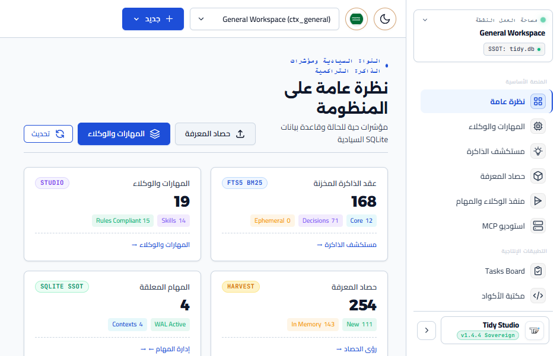

# 🖥️ دليل استوديو سطح المكتب السيادي — Tidy Studio (`@tidy/desktop`)
<!-- Status: Living Documentation -->
<!-- SemVer SSOT: v1.4.5 -->

يعتبر **Tidy Studio** واجهة الإدارة البصرية الرائدة لمنظومة **تايدي (Tidy)**، وهو تطبيق سطح مكتب أصلي لنظام التشغيل **Windows x64** (مع معمارية جاهزة للعمل على macOS و Linux) مبني بواسطة إطار العمل **Electron**، ومتصل مباشرة ومحلياً بالنواة الصلبة لقاعدة بيانات SQLite السيادية (`~/.tidy/tidy.db`).

---

## 🌟 معرض الشاشات والواجهات المرئية (Visual Showcase)

<div align="center" dir="rtl">

### 1. لوحة المتابعة والمؤشرات الحيوية (Overview & Telemetry)
*متابعة حالة قاعدة البيانات، مساحة التخزين المستهلكة، نمط WAL، وعدادات الذاكرة، مع شريط الالتقاط السريع.*


---

### 2. استوديو المهارات والوكلاء الشامل (Universal Skills & Agents Studio)
*اكتشاف المهارات عبر كافة بيئات التطوير (Claude Code, Cursor, Antigravity, Windsurf)، محرر نصوص مونو-سبيس، شجرة AST متزامنة، وفاحص الامتثال لـ 15 قاعدة من معايير Skills-LAB.*


---

### 3. مستكشف الذاكرة المعرفية (Memory Explorer — FTS5 BM25)
*محرك بحث نصوص فائق السرعة، مع خوارزمية التراجع الزمني التلقائي (Decay Scoring) ومؤشرات النجوم وتصفية المجالات.*


---

### 4. استوديو حصاد واستخراج المعارف (Knowledge Harvester Studio)
*لوحتان مستقلتان (Master-Detail) لفحص عقول الوكلاء وملفات `~/.gemini/knowledge/**`، ومعاينة الماركداون الحية، والابتلاع الذري.*


---

### 5. إدارة الصفقات والعملاء (Sovereign B2B CRM Pipeline)
*تنظيم العملاء ومراحل الصفقات، تدوين الملاحظات التراكمية، واستخراج ملفات العملاء الاستخباراتية بالذكاء الاصطناعي.*


---

### 6. الفواتير والتدفقات النقدية (Invoices & Live Cashflow)
*إصدار فواتير مجزأة مع حساب آلي للضرائب والخصومات، وتتبع كشف الأرباح والخسائر وهامش الربحية اللحظي.*


---

### 7. نافذة المساعد الشفافة العائمة (Global Floating HUD)
*استدعاء فوري في أقل من 10ms عبر الاختصار `Alt + Space` للبحث السريع في الذاكرة وتدوين القرارات وتفويض المهام.*



</div>

---

## 🏛️ استعراض التبويبات الـ 14 المدمجة بالتطبيق

| الرقم | التبويب | الوظيفة التشغيلية | الحزمة المسؤولة |
|:---:|---|---|---|
| **1** | **نظرة عامة (Overview)** | لوحة متابعة إحصائيات النظام ومؤشرات SQLite اللحظية وتنبيهات المهام | `@tidy/core` |
| **2** | **استوديو المهارات (Skills Studio)** | فحص بيئات الوكلاء، محرر أكواد متقدم، التحقق من القواعد الـ 15 | `skills-loader.js` |
| **3** | **مستكشف الذاكرة (Memory Explorer)** | استعلام واسترجاع فوري لقرارات المشروع ونصوص الذاكرة الدائمة | `memory.js` |
| **4** | **حصاد المعارف (Knowledge Harvester)** | فحص جلسات العمل وعقول Antigravity واستخراج المعارف ذرياً | `knowledge-harvester.js` |
| **5** | **مشغّل الوكلاء (Agent Runner)** | إطلاق الوكلاء الفرعيين (`@coder`، `@marketing`...) بموجزات مهام ذاتية | `brief-generator.js` |
| **6** | **استوديو MCP (MCP Studio)** | معاينة الأدوات الـ 29 والموارد الـ 9 الحية واختبار JSON-RPC | `@tidy/mcp` |
| **7** | **لوحة المهام (Tasks Board)** | لوحة كانبان ثلاثية الأعمدة لتصنيف وإسناد المهام للمساعدين | `tasks.js` |
| **8** | **قصاصات الكود (Code Snippets)** | خزينة مخصصة للأكواد الشائعة والتكوينات مع نسخ فوري | `snippets.js` |
| **9** | **اليوميات (Daily Journal)** | تدوين المذكرات والملاحظات التطويرية وسجلات التغيير اليومية | `journal.js` |
| **10** | **الخزينة (Vault & Secrets)** | إدارة المفاتيح والبيانات الحساسة محلياً دون رفعها للسحابة | `vault.js` |
| **11** | **العملاء (CRM Pipeline)** | قاعدة بيانات العملاء ومسارات الصفقات وميزانيات المشاريع | `@tidy/office` |
| **12** | **الفواتير (Invoices & Billing)** | إنشاء فواتير بنود تفصيلية مع احتساب تلقائي للضريبة | `@tidy/office` |
| **13** | **التدفق النقدي (Cashflow & P&L)** | كشف الأرباح والمصروفات اللحظي وحساب صافي الهامش المالي | `@tidy/office` |
| **14** | **الإعدادات والصحة (Settings & Health)** | صيانة وضغط SQLite (`VACUUM`) وتبديل سياق العمل | النواة الأساسية |

---

## ⚡ شاشة المساعد الطافية السريعة (The HUD)

الـ HUD (Heads-Up Display) مصممة لتكون امتداداً عصبياً للمطور أثناء عمله في محررات الأكواد:
- **الاختصار الشامل**: اضغط `Alt + Space` في أي مكان لنزول النافذة فورياً في منتصف الشاشة.
- **إخفاء ذكي عند فقدان التركيز**: بمجرد الضغط خارجها، تتلاشى بهدوء دون ترك أي نوافذ عالقة.
- **تسجيل الأفكار والقرارات في ثوانٍ**: اكتب فكرتك واضغط Enter لتُحفظ في جدول الذاكرة مباشرة.
- **أيقونة شريط المهام (System Tray)**: وصول سريع وإدارة للنظام بجوار ساعة النظام.

---

## 🔒 معايير الأمان وعزل العمليات (Process Isolation)

تطبيق سطح المكتب يتبع ميثاق أمان Electron القياسي لحماية المطور:
1. **`nodeIntegration: false`**: واجهة المستخدم (Renderer) لا تملك أي وصول مباشر لمكتبات Node.js أو دوال النظام.
2. **`contextIsolation: true`**: حظر تام لتداخل سياقات الجافاسكريبت، والتواصل محصور في بوابة `window.tidyApi`.
3. **قنوات IPC مسبقة التعريف**: كافة الطلبات موثقة بالبادئة `tidy:` ومفحوصة بالكامل قبل تمريرها لقاعدة البيانات.
4. **سيادية تامة (Zero Cloud Telemetry)**: لا توجد أي خوادم خارجية لجمع البيانات؛ كل شيء يُخزّن ويُعالج على جهازك.

---

## 🚀 التشغيل وبناء حزم التثبيت (Build & Distribution)

### 1. وضع التطوير المباشر
```bash
# من المجلد الرئيسي للمشروع:
npm run desktop

# أو مباشرة من مجلد التطبيق المكتبي:
cd apps/desktop
npm start
```

### 2. بناء ملف التثبيت الأصلي لويندوز (Installer & Portable)
```bash
# بناء حزمة الإعداد التنفيذية NSIS مع النسخة المحمولة:
npm run desktop:build

# أو من داخل مجلد apps/desktop:
npm run build:win
npm run build:portable
```

يتم إخراج الملفات التنفيذية الجاهزة للتوزيع داخل مجلد `apps/desktop/dist/`:
- `Tidy-Studio-Setup-1.4.5.exe` (ملف تثبيت متكامل مع اختصارات سطح المكتب وقائمة ابدأ)
- `Tidy-Studio-Portable-1.4.5.exe` (نسخة محمولة تعمل فوراً بدون تثبيت من أي مجلد أو ذاكرة فلاش)
