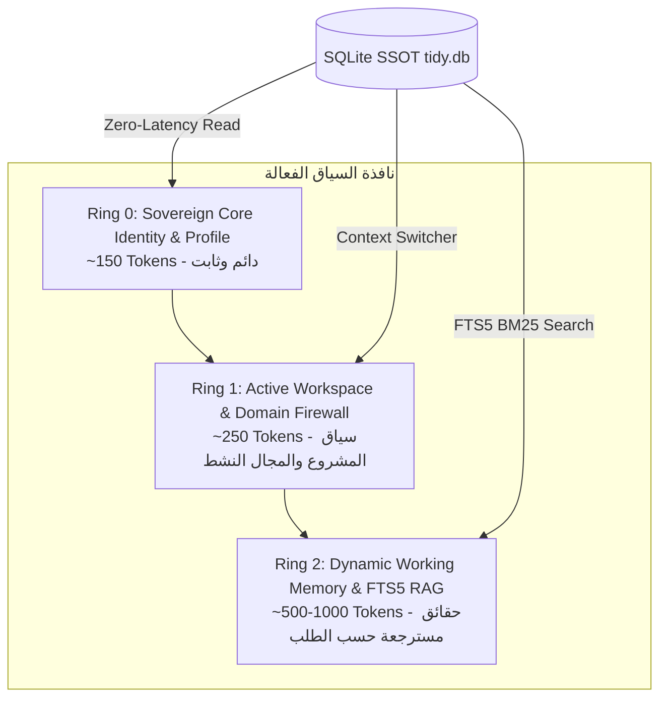

# وثيقة المواصفات المعمارية لنظام Tidy (Sovereign Personal Assistant Agent)

**الإصدار**: v1.4.2 (Production Monorepo)  
**المرجعية المعمارية**: `TidyFactor Skills-LAB` (الحوكمة الهيكلية) + `Qahera UI Kit` (نظام التصميم)  
**النمط**: Local-First, Zero-Config, Sovereign Memory, Single SQLite SSOT, Modular Monorepo  

---

## 1. الرؤية المعمارية والتكامل المشترك (System Synergy)

يعمل نظام **Tidy** كمساعد شخصي سيادي (Autonomous Sovereign Personal Assistant) يمتلك ذاكرة نشطة دائمة متصلة مباشرة عبر SQLite. 

### كيف يتكامل Tidy مع مهارات TidyFactor؟
* **من `tidyfactor-skill-architect`**: يستمد Tidy صرامة الهيكل (15 قاعدة هيكلية)، وتصميم الـ Dispatcher الخفيف (`SKILL.md` ~350 توكن)، وميثاق بوابات القرارات (Contextual Decision Layer CDL v2.0)، وأولوية YAML للبيانات الوصفية.
* **من `tidyfactor-brain`**: يستمد Tidy فلسفة عزل المجالات (Contextual Firewalls)، وتصنيف الذاكرة المتعدد (Tiered Taxonomy)، وتقنيات الاسترجاع السريع دون تلويث نافذة السياق بالبيانات الخام، ودورات تنظيف الذاكرة (Storage Hygiene & Decay).

---

## 2. هندسة إدارة السياق المقترحة (The 3-Ring Context Architecture)

لحل مشكلة "تشتت الذاكرة" أو "امتلاء نافذة السياق (Context Window Bloat)"، نعتمد نموذج الحلقات الثلاث المتداخلة:



### 1. الحلقة 0 (Ring 0: Sovereign Identity & User Profile)
- **المحتوى**: بروفايل المستخدم الثابت، لغة التخاطب المفضلة، القواعد الحاكمة العامة، والسمات الشخصية للمساعد.
- **الحجم**: خفيف جداً (~150 توكن).
- **السلوك**: يُحقن تلقائياً في بداية أي جلسة كـ Baseline غير قابل للتعديل أثناء العمليات الروتينية.

### 2. الحلقة 1 (Ring 1: Active Workspace & Domain State)
- **المحتوى**: معرف المشروع الحالي (`project_id`)، وضع العمل المفعل (مثلاً: `dev_mode` أو `biz_mode` أو `personal_mode`)، والوكيل الفرعي النشط.
- **مبدأ الجدار الناري (Contextual Firewall)**: مستعار من `tidyfactor-brain`؛ إذا كان المساعد يعمل في وضع البرمجة `[Dev Mode]`، تُحجب تماماً سجلات وقوائم التسويق أو المهام الشخصية من السياق لمنع التشتت والخلط الإدراكي (Context Bleed).

### 3. الحلقة 2 (Ring 2: Dynamic Working Memory & FTS5 Recall)
- **المحتوى**: الحقائق والقرارات والمهام المسترجعة ديناميكياً فقط عند الحاجة بناءً على استعلام المستخدم (On-Demand Retrieval).
- **الآلية**: استدعاء دقيق عبر بحث FTS5 في SQLite؛ يتم جلب المقاطع الأشد صلة بالطلب الحالي فقط بدلاً من حقن السجل التاريخي بالكامل.

---

## 3. هندسة إدارة قاعدة البيانات المتقدمة (SQLite SSOT Architecture)

### 1. إعدادات الأداء والمرونة (High-Performance Engine Tuning)
عند إنشاء أو فتح قاعدة البيانات، يقوم المحرك تلقائياً بتطبيق إعدادات الـ PRAGMA التالية:

```sql
PRAGMA journal_mode = WAL;          -- كتابة متزامنة سريعة وقراءة متوازية دون أقفال
PRAGMA synchronous = NORMAL;        -- أعلى سرعة مع ضمان السلامة عند انقطاع الطاقة
PRAGMA foreign_keys = ON;          -- التحقق الصارم من العلاقات التناغمية
PRAGMA temp_store = MEMORY;         -- معالجة الجداول المؤقتة داخل الرام
PRAGMA mmap_size = 268435456;      -- Memory-mapped I/O (256MB) لقراءة فائقة السرعة
PRAGMA cache_size = -64000;         -- حجز 64MB كاش في الذاكرة للعمليات المتكررة
```

### 2. المخطط العلائقي الكامل (Complete Database Schema DDL)

```sql
-- 1. جدول الإعدادات العامة والمتغيرات الثابتة
CREATE TABLE IF NOT EXISTS system_config (
    key TEXT PRIMARY KEY,
    value TEXT NOT NULL,
    updated_at DATETIME DEFAULT CURRENT_TIMESTAMP
);

-- 2. جدول البروفايل الشخصي للمستخدم والمساعد
CREATE TABLE IF NOT EXISTS user_profile (
    id TEXT PRIMARY KEY DEFAULT 'primary',
    user_name TEXT NOT NULL,
    assistant_name TEXT NOT NULL DEFAULT 'Tidy',
    locale TEXT DEFAULT 'ar',
    tone TEXT DEFAULT 'concise_expert',
    preferences_json TEXT DEFAULT '{}',
    created_at DATETIME DEFAULT CURRENT_TIMESTAMP,
    updated_at DATETIME DEFAULT CURRENT_TIMESTAMP
);

-- 3. جدول السياقات النشطة والمشاريع
CREATE TABLE IF NOT EXISTS contexts (
    id TEXT PRIMARY KEY,
    name TEXT NOT NULL,
    domain TEXT NOT NULL CHECK (domain IN ('dev', 'marketing', 'personal', 'ops', 'general')),
    workspace_path TEXT,
    is_active INTEGER DEFAULT 0,
    metadata_yaml TEXT DEFAULT '',
    created_at DATETIME DEFAULT CURRENT_TIMESTAMP,
    last_accessed_at DATETIME DEFAULT CURRENT_TIMESTAMP
);

-- 4. جدول عقد الذاكرة طويلة وقصيرة المدى (Memory Nodes)
CREATE TABLE IF NOT EXISTS memory_nodes (
    id TEXT PRIMARY KEY,
    context_id TEXT REFERENCES contexts(id) ON DELETE CASCADE,
    tier TEXT NOT NULL CHECK (tier IN ('core', 'project', 'session', 'ephemeral')),
    category TEXT NOT NULL CHECK (category IN ('fact', 'decision', 'pattern', 'preference', 'task', 'rule')),
    content TEXT NOT NULL,
    summary TEXT,
    importance INTEGER DEFAULT 3 CHECK (importance BETWEEN 1 AND 5),
    access_count INTEGER DEFAULT 0,
    decay_score REAL DEFAULT 1.0,
    created_at DATETIME DEFAULT CURRENT_TIMESTAMP,
    last_accessed_at DATETIME DEFAULT CURRENT_TIMESTAMP
);

-- 5. جدول البحث السريع بالنصوص والكلمات المفتاحية (SQLite FTS5)
CREATE VIRTUAL TABLE IF NOT EXISTS memory_fts USING fts5(
    node_id UNINDEXED,
    content,
    summary,
    tokenize = 'unicode61 remove_diacritics 2'
);

-- التريجرز التلقائية لتحديث FTS5 تلقائياً عند أي إضافة أو تعديل أو حذف
CREATE TRIGGER IF NOT EXISTS trg_memory_nodes_ai AFTER INSERT ON memory_nodes BEGIN
    INSERT INTO memory_fts(node_id, content, summary) VALUES (new.id, new.content, new.summary);
END;

CREATE TRIGGER IF NOT EXISTS trg_memory_nodes_ad AFTER DELETE ON memory_nodes BEGIN
    DELETE FROM memory_fts WHERE node_id = old.id;
END;

CREATE TRIGGER IF NOT EXISTS trg_memory_nodes_au AFTER UPDATE ON memory_nodes BEGIN
    DELETE FROM memory_fts WHERE node_id = old.id;
    INSERT INTO memory_fts(node_id, content, summary) VALUES (new.id, new.content, new.summary);
END;

-- 6. جدول الوكلاء الفرعيين (Sub-Agents Registry)
CREATE TABLE IF NOT EXISTS subagents (
    id TEXT PRIMARY KEY,
    name TEXT NOT NULL UNIQUE,
    role TEXT NOT NULL,
    description TEXT NOT NULL,
    system_prompt TEXT NOT NULL,
    allowed_tools_json TEXT DEFAULT '[]',
    is_enabled INTEGER DEFAULT 1,
    created_at DATETIME DEFAULT CURRENT_TIMESTAMP
);

-- 7. جدول مكتبة التطبيقات والـ Sidecars المثبتة
CREATE TABLE IF NOT EXISTS installed_apps (
    id TEXT PRIMARY KEY,
    name TEXT NOT NULL UNIQUE,
    version TEXT NOT NULL,
    entry_point TEXT NOT NULL,
    config_json TEXT DEFAULT '{}',
    is_active INTEGER DEFAULT 1,
    installed_at DATETIME DEFAULT CURRENT_TIMESTAMP
);

-- 8. سجل العمليات والتدقيق (Audit & Action Log)
CREATE TABLE IF NOT EXISTS audit_log (
    id INTEGER PRIMARY KEY AUTOINCREMENT,
    action TEXT NOT NULL,
    component TEXT NOT NULL,
    details_json TEXT,
    timestamp DATETIME DEFAULT CURRENT_TIMESTAMP
);
```

### 3. دورة حياة الذاكرة وتخفيف التكدس (Memory Decay & Storage Hygiene)
مستعار من نمط `hygiene` في `tidyfactor-brain`:
* كل عقدة ذاكرة تمتلك `decay_score` يتناقص مع الوقت إذا لم تُستدعَ، ويزداد عند الاسترجاع المتكرر (`access_count`).
* أمر الصيانة `tidy memory prune --days 30` يقوم تلقائياً بمسح الجلسات المؤقتة (`ephemeral`) التي انتهت صلاحيتها، مع الحفاظ الصارم على ذاكرة الـ `core` والـ `decision`.
* دعم النسخ الاحتياطي التلقائي: `VACUUM INTO 'tidy_backup.db'` قبل أي تحديث للمخطط.

---

## 4. محرك الـ CLI ومكتبة التطبيقات (CLI & App Library Engine)

### استراتيجية التنفيذ الصامت والتهيئة الذاتية (Zero-Config First Run)
عند تنفيذ أي أمر، تقوم دالة `ensureDatabaseReady()` بالآتي:
1. فحص وجود مسار البيانات `~/.tidy/tidy.db` (أو مسار المشروع المحلي `.tidyfactor/tidy.db`).
2. إن لم يكن الملف موجوداً: إنشاء المجلد تلقائياً، تنفيذ أوامر الـ DDL، تفعيل الـ WAL، وحقن بروفايل أولي افتراضي (`Seed Data`).
3. طباعة رسالة تشغيل نظيفة والانتقال الفوري لتنفيذ أمر المستخدم دون توقف أو استفسارات إضافية.

### شجرة أوامر الـ CLI (`bin/tidy.js`):
```bash
tidy init                       # فحص أو تهيئة بيئة التخزين وقاعدة البيانات
tidy whoami                     # عرض هوية المستخدم والوضع والسياق النشط
tidy context [list|switch|new]  # إدارة السياقات وتبديل مشاريع العمل
tidy memory [recall|save|forget]# البحث والاسترجاع بالكلمات المفتاحية وحفظ الملاحظات
tidy agent [list|run|register]  # إدارة الوكلاء الفرعيين واستدعاء مهامهم
tidy app [list|install|run]     # تثبيت وتشغيل أدوات مكتبة التطبيقات
tidy mcp [start|test]           # تشغيل خادم MCP المحلي لبيئات الذكاء الاصطناعي
tidy db [vacuum|backup|stats]   # صيانة وفحص إحصائيات قاعدة البيانات
```

---

## 5. ميثاق خادم MCP المحلي (Local Stdio MCP Protocol Contract)

يعمل خادم MCP المدمج (`packages/mcp/src/server.js`) كجسر مباشر بين محررات الذكاء الاصطناعي (Antigravity IDE / Cursor / Claude Code) وقاعدة بيانات `tidy.db` عبر `stdio` JSON-RPC 2.0.

### مصفوفة أدوات MCP الأساسية (Standard MCP Tools):

| اسم الأداة (Tool Name) | الوظيفة والمعاملات | النتيجة المرجعة |
| :--- | :--- | :--- |
| `tidy_recall` | استرجاع الذاكرة باستخدام FTS5 (`query`, `category`, `limit`) | قائمة من عناصر الذاكرة المرتبة حسب مطابقة BM25 |
| `tidy_memorize` | حفظ حقيقة أو قرار جديد (`content`, `tier`, `category`, `importance`) | معرف العقدة المحفوظة `node_id` وتأكيد الإدراج في FTS5 |
| `tidy_get_context` | قراءة سياق العمل النشط والبروفايل الحاكم | كائن JSON يحتوي الحلقة 0 والحلقة 1 بالكامل |
| `tidy_switch_context` | الانتقال لمشروع أو مجال عمل آخر (`context_id`) | تحديث سياق الجلسة وتطبيق الجدار الناري فورياً |
| `tidy_exec_subagent` | تفويض مهمة إلى وكيل فرعي متخصص (`agent_name`, `task`) | مخرجات عمل الوكيل الفرعي وحفظ نتيجة المهمة |
| `tidy_db_stats` | فحص حجم قاعدة البيانات وعدد العناصر وصحة الفهارس | تقرير فني ملخص عن كفاءة التخزين المحلي |

---

## 6. استراتيجية المزامنة المستقبلية (Future Extensibility Roadmap)

لضمان إمكانية مزامنة الذاكرة عبر الأجهزة مستقبلاً دون المساس بمبدأ Local-First SSOT:
1. **عزل طبقة التخزين (Storage Driver Abstraction)**: يتم الوصول لقاعدة البيانات عبر `StorageEngineInterface`.
2. **بروتوكول المزامنة غير المتزامن (Outbound Background Sync)**:
   - دعم التزامن اللامركزي لاحقاً باستخدام تقنيات مثل **CRDTs** (Conflict-free Replicated Data Types) أو **Turso / LibSQL Embedded Replicas** أو **Litestream** للنسخ الاحتياطي في سحابة المستخدم الخاصة.
   - تظل قاعدة بيانات SQLite المحلية هي مصدر الحقيقة الأول (Primary Local SSOT) وتتم المزامنة في الخلفية بدون انتظار الشبكة (Zero Network Latency Penalty).

---

## 7. هيكلية الـ Monorepo وعزل الحزم (Monorepo Topology)

يعتمد المستودع مبدأ "الجذر النظيف" (Clean Root)، بحيث يحتوي الجذر فقط على ملف `README.md` واحد يربط كافة الأدلة، مع عزل المهارة وأدواتها بالكامل داخل حزمتها المعيارية:

```text
tidy-agent/
├── packages/
│   ├── core/      --> (@tidy/core) نواة SQLite ومحرك الذاكرة FTS5 BM25
│   ├── cli/       --> (@tidy/cli) سطر الأوامر التفاعلي عبر @clack/prompts
│   ├── mcp/       --> (@tidy/mcp) خادم بروتوكول Stdio JSON-RPC 2.0
│   ├── skill/     --> (@tidy/skill) المهارة المعتمدة (references/, manifest.json, tools/)
│   └── office/    --> (@tidy/office) حزمة إدارة الأعمال المستقلة (CRM, Invoicing, Proposals)
├── apps/
│   ├── desktop/   --> تطبيق سطح المكتب Electron بنظام ويندوز
│   └── web/       --> كونسول الويب المحلي (127.0.0.1:3840)
├── docs/          --> المجلد الموحد للتوثيق (Master index, specs/, i18n/, user_manual)
├── bin/           --> مشغل الطرفية العالمي (tidy)
├── scripts/       --> وسائط التوافق العكسي مع النواة
├── tests/         --> حزمة الاختبارات الشاملة (33 اختباراً)
└── tools/         --> أداة فحص الأمان والتسريبات (check-leaks.js)
```

---

## 8. خدمات النواة المشتركة للمرحلة الثالثة (Core OS Platform Services: v1.4.3 – v1.5.0)

لضمان عمل كافة التطبيقات المصغرة والإضافات الخارجية بمرونة وتكامل دون تكرار الكود:
1. **محرك الحوكمة والإعدادات (`system_config`)**: واجهة مركزية لحفظ واسترجاع متغيرات التشغيل، تفضيلات المستخدم، الثيمات، واللغات.
2. **محرك تعدد قواعد بيانات SQLite (Multi-DB Pool)**: القدرة على إنشاء والتبديل الحي بين قواعد بيانات متعددة (`Switch Active SSOT`).
3. **موجه خدمات الذكاء الاصطناعي (AI Provider Center)**: دعم مفاتيح النماذج الخارجية (BYOK) والنماذج المحلية (Local AI عبر Ollama / LM Studio).
4. **مدير دورة حياة الإضافات (Plugin Manager)**: آلية تسجيل المخططات (`registerSchema`) والمشابك الحدثية (Event Hooks).

